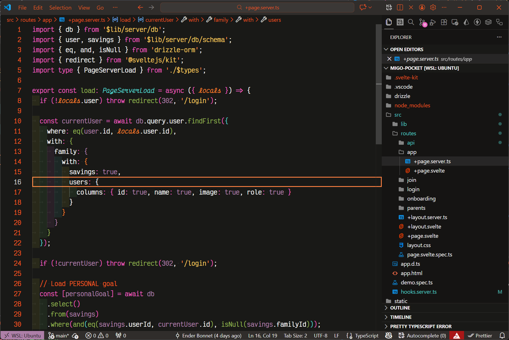
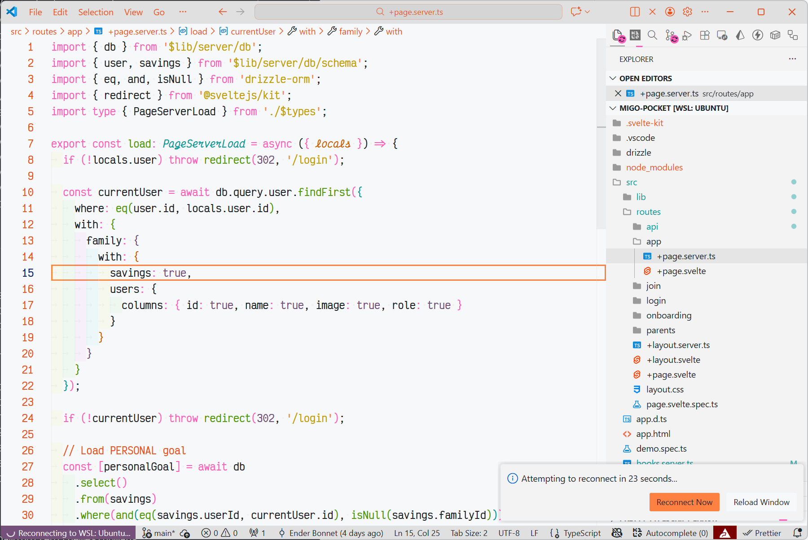
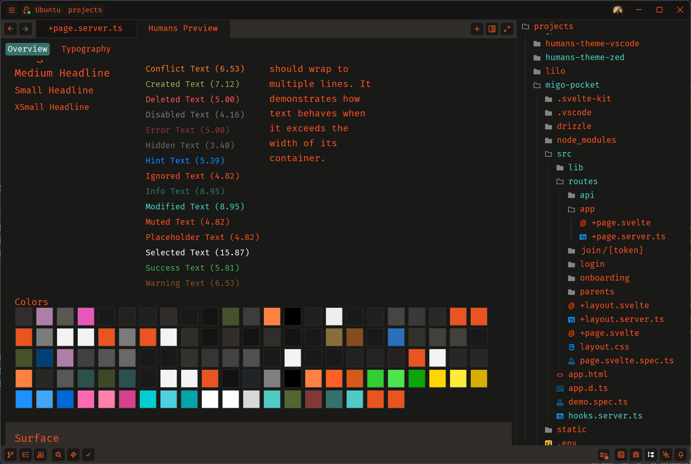
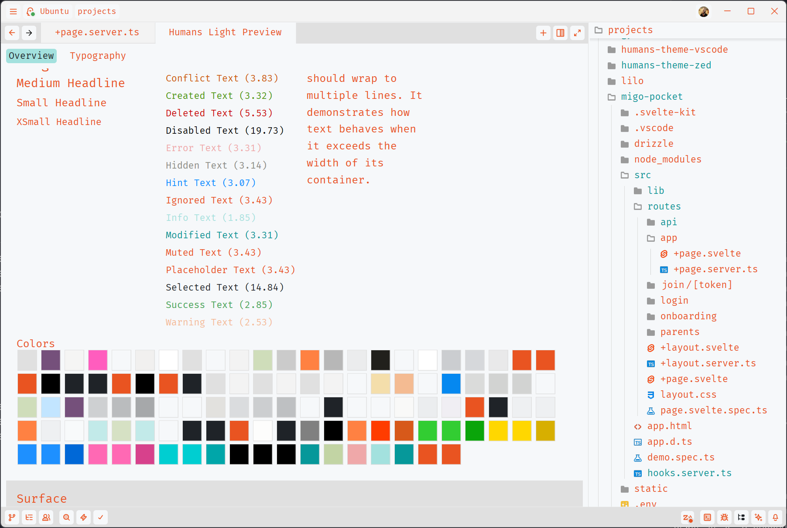

# Migrazed

Convert VS Code themes to Zed editor format.

## Overview

Migrazed is a CLI tool that converts VS Code theme JSON files to Zed's theme format. It supports both dark and light theme variants and can merge them into a single Zed theme file.

## Installation

```bash
bun install -g migrazed
```

Or use directly with npx:

```bash
bunx migrazed <dark-theme.json> [options]
```

## Usage

```bash
migrazed <dark-theme.json> [-l <light-theme.json>] [-o <output-path>]
```

### Arguments

- `<dark-theme.json>` - Path to the VS Code dark theme JSON file (required)
- `-l, --light <path>` - Path to the VS Code light theme JSON file (optional)
- `-o, --output <path>` - Output path for the Zed theme file (optional)

### Examples

Convert a single dark theme:

```bash
migrazed ./themes/my-theme-dark.json
```

Convert and merge both dark and light variants:

```bash
migrazed ./themes/my-theme-dark.json -l ./themes/my-theme-light.json -o ./output/my-theme.json
```

## Examples

### VS Code Theme

**Dark:**



**Light:**



### Zed Theme

**Dark:**



**Light:**



## Features

- Converts VS Code color themes to Zed format
- Supports both dark and light theme variants
- Merges multiple variants into a single theme file
- Preserves semantic highlighting colors
- Maps terminal ANSI colors
- Converts syntax token colors to Zed's style system

## Documentation

- [Migration Guide](docs/migration.md) - Detailed guide on migrating themes
- [VS Code Theme Variables](docs/vscode-theme-variables.md) - VS Code theme variable reference
- [Zed Theme Variables](docs/zed-theme-variables.md) - Zed theme variable reference
- [Crossover Mapping](docs/crossover.md) - Variable mapping between editors

## License

MIT

## Author

With <3 by [Ender Bonnet](https://enbonnet.com)
